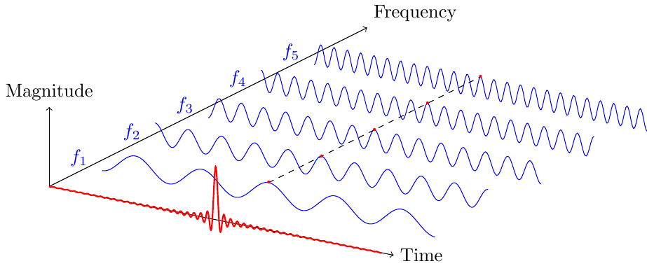

 This short course is part of the international master program [Factory of the future](https://artsetmetiers.fr/en/mecanique-energie-et-ingenierie) proposed by *Arts et Métiers Institute of Technology*.
Note that students enrolling in this program may come from very different backgrounds.
As such, the aim of this course is to teach them the basics of Fourier analysis and signal processing.
One or two small numerical projects in `python` or `octave` are also proposed.

## Prerequisite
- Basic mathematics (e.g. derivative and integrals, complex numbers, etc).
- Prior knowledge of `python`, `octave` or `matlab` would be beneficial.

## Lesson plan

The course is divided in six 2-hour long lectures and a few exercises.
The tentative lesson plan below may be subject to modifications as the course evolves pretty much every year when interacting with students.
I will try to keep this `README` up to date every time the course is modified.

- Lecture 1: ...

## Recommended reading
- TBA

## Additional resources
- [SciPy lectures](https://scipy-lectures.org/)
- [3Blue1Brown : But what is the Fourier transform?](https://www.youtube.com/watch?v=spUNpyF58BY)

