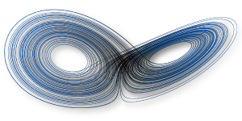

 This course is part of the master program [M2 Aérodynamique et Aéroacoustique](http://master.spi.sorbonne-universite.fr/fr/mecanique-des-fluides/m2-aerodynamique-et-aeroacoustique/liste_des_ue.html) proposed jointly by *Université Pierre et Marie Curie* and *Arts et Métiers Institute of Technology*.
Its aim is to give students an overview of the typical behaviours dynamical systems can exhibit (i.e. fixed points, periodic orbits, quasi-periodic dynamics and temporal chaos) and how to study them (e.g. fixed point computation, linear stability, bifurcation and normal form theory, Takens embedding theorem, etc).
Most of the course consists in sessions of two-hour long lectures with a few exercises.
A small numerical project in `python` or `julia` on realistic systems from fluid dynamics or classical mechanics is also proposed.

## Prerequisite
- Course primarily intended for students with some background in physics, mechanics or applied mathematics.
- Basics of matrix calculus, Taylor series and differential equations.
- Prior knowledge of `python` or `julia` would be highly beneficial for the numerical project.

## Lesson plan

The course is divided in 10ish 2-hour long lectures and a few exercises.
The tentative lesson plan below may be subject to modifications as the course evolves pretty much every year when interacting with students.
I will try to keep this page up to date every time the course is modified.

- Lecture 1: What are dynamical systems and how do we study them? [[Slides]](https://github.com/loiseaujc/Teaching/blob/master/Nonlinear_physics/Lecture_1/Slides/slides.pdf), [[Jupyter Notebook]](https://github.com/loiseaujc/Teaching/blob/master/Nonlinear_physics/Lecture_1/Notebook/A%20few%20examples%20of%20dynamical%20systems.ipynb)
- Lecture 2: First-order and second-order systems. [[Slides]](https://github.com/loiseaujc/Teaching/blob/master/Nonlinear_physics/Lecture_2/Slides/slides.pdf), [[Jupyter Notebook]](https://github.com/loiseaujc/Teaching/blob/master/Nonlinear_physics/Lecture_2/Notebook/Fixed%20points%20and%20linear%20stability.ipynb), [[Exersices]](https://github.com/loiseaujc/Teaching/blob/master/Nonlinear_physics/Lecture_2/Exercises/main.pdf)
- Lecture 3: Stable and unstable manifolds. [[Slides]](https://github.com/loiseaujc/Teaching/blob/master/Nonlinear_physics/Lecture_3/Slides/slides.pdf)
- Lecture 4: Elements of bifurcation theory. [[Slides]](https://github.com/loiseaujc/Teaching/blob/master/Nonlinear_physics/Lecture_4/Slides/slides.pdf)

## Recommended reading
- Steven Strogatz. [*Nonlinear dynamics and chaos*](http://www.stevenstrogatz.com/books/nonlinear-dynamics-and-chaos-with-applications-to-physics-biology-chemistry-and-engineering) (English only).
- James Gleick. [*Chaos: Making a new science*](https://www.amazon.com/Chaos-Making-Science-James-Gleick/dp/0143113453) (English) or [*La théorie du chaos: vers une nouvelle science*](https://www.amazon.com/th%C3%A9orie-chaos-Vers-nouvelle-science/dp/2081218046) (French).
- Paul Manneville. [*Instabilities, chaos and turbulence*](https://www.worldscientific.com/worldscibooks/10.1142/p642) (English) or [*Instabilités, chaos et turbulence*](https://www.amazon.fr/Instabilit%C3%A9s-chaos-turbulence-Paul-Manneville/dp/2730209131) (French).

## Additional resources
- P. Cvitanovic. [Chaos book](http://chaosbook.org/).
